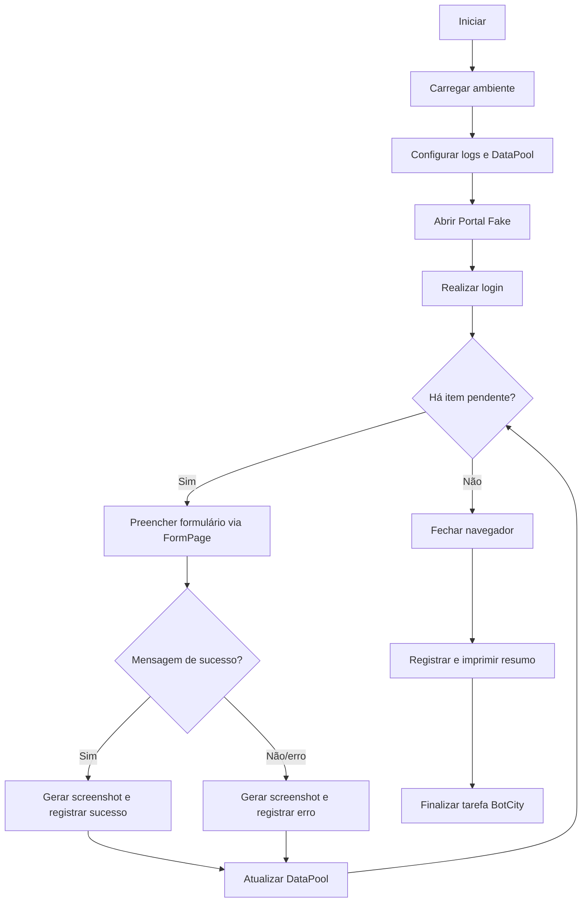

# PDD — Automação de cadastro de lotes

## 1. Objetivo

Processar lotes fictícios em uma aplicação web local, registrar o resultado no
DataPool simulado e gerar evidências e logs auditáveis.

## 2. Escopo

Inclui login fictício, leitura do JSON, cadastro, validação, screenshot por
item, atualização do resultado, resumo e integração de status com BotCity.
Não inclui sistemas reais, dados pessoais, banco de dados ou credenciais reais.

## 3. Fluxograma

## 4. Arquitetura

| Componente | Responsabilidade |
|---|---|
| `main.py` | Entrada local |
| `bot.py` | Entrada e status do BotCity |
| `orquestrador.py` | Seleção Playwright/Selenium |
| `web_automation.py` | Ciclo de vida Playwright |
| `selenium_automation.py` | Ciclo de vida Selenium |
| `fluxo_lotes.py` | Regras, logs, evidências e DataPool |
| `datapool.py` | Persistência do DataPool local |
| `configuracao.py` | Ambiente e caminhos |
| `navegador.py` | WebDriver |
| `pages/login_page.py`, `pages/form_page.py` | Interface Playwright |
| `pages/*_selenium.py` | Interface Selenium |
| `portal_fake/` | Sistema fictício |

## 5. Entradas

- Variáveis do `.env`.
- `resources/datapool_lotes.json`.
- Portal Fake local.

Todos os registros são sintéticos.

## 6. Saídas

- `logs/datapool_resultado.json`.
- `logs/execucao.log`.
- `evidencias/<item>_<timestamp>.png`.
- Resumo no terminal.
- Status da tarefa quando online no BotCity.

## 7. Fluxo do robô

O navegador é criado uma vez pelo orquestrador específico. O login ocorre uma
vez. O fluxo compartilhado percorre o DataPool, chama ações dos Page Objects,
valida o retorno, salva a evidência e atualiza o item antes de avançar. Ao
final, browser/driver é sempre encerrado em `finally`.

### 7.1 Estratégia Page Object Model

Os Page Objects são separados por tecnologia. As classes Playwright recebem
`page`; as classes Selenium recebem `driver`. Todos os seletores e comandos de
interação ficam nesses objetos. Eles não conhecem DataPool, logger, contadores
ou decisões de negócio. `APP_TECNOLOGIA` seleciona `selenium` ou `playwright`
sem alterar o fluxo funcional.

## 8. DataPool

O adaptador local carrega uma lista JSON e entrega cópias dos itens ao
orquestrador. `atualizar()` associa status, mensagem e screenshot ao ID e
persiste o estado completo após cada processamento.

## 9. Screenshots

São produzidas tanto em sucesso quanto em falha. O nome inclui ID normalizado,
data, hora e microssegundos. O caminho é salvo no resultado do DataPool.

## 10. Logs

O logger grava JSON em UTF-8. Eventos registram início, fim, item, warnings,
exceções, evidência, contadores e duração em segundos.

## 11. Tratamento de erros

- Falha de configuração interrompe antes de abrir o navegador.
- Erro de um item é capturado e não impede os itens seguintes.
- Falha de screenshot gera warning.
- Exceções preservam stack trace no log.
- `finally` garante fechamento do navegador e log final.
- O BotCity recebe `FAILED` quando a execução global lança exceção.

## 12. Segurança

Não há integração com sistemas reais. `.env`, logs, evidências, cookies,
imagens, bancos e ZIPs são ignorados. O código não contém tokens ou credenciais.

## 13. Riscos

| Risco | Mitigação |
|---|---|
| Chrome indisponível | Documentar requisito e usar Selenium Manager |
| Alteração de IDs | Locators centralizados nos Pages |
| Item inválido | Isolamento por item e registro de erro |
| Colisão de evidências | Timestamp com microssegundos |
| Interrupção | Persistência após cada item |
| Segredo versionado | `.gitignore` e `.env.example` fictício |

## 14. Melhorias futuras

- Adaptador oficial do DataPool Maestro.
- Publicação de screenshots como artefatos.
- Validação de schema JSON.
- Métricas e dashboard de execução.
- Pipeline CI com relatório de testes.
